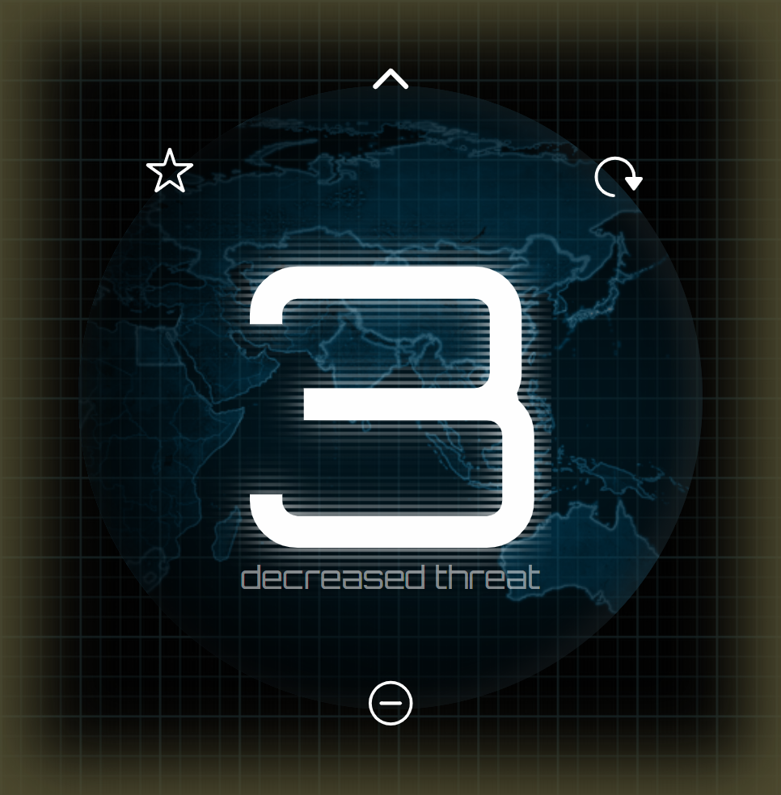

# X-COM board game threat counter

Simple small progressive web application for managing threat levels: simple counter from 1 to 5 that looks & sounds pretty.

[Try it](https://xcomthreat.amadare.top/)

## Android: add to home screen

1. Open [application](https://xcomthreat.amadare.top/) in Chrome on Android
2. Tap ⋮ symbol
3. Tap "Add to home screen"

## Controls

- tap/click to increase
- two finger touch to decrease

## Features

- auto resets on increase while on 5
- current state timer
- hideable buttons
- adjustable graphics
- sounds
- cool animations
